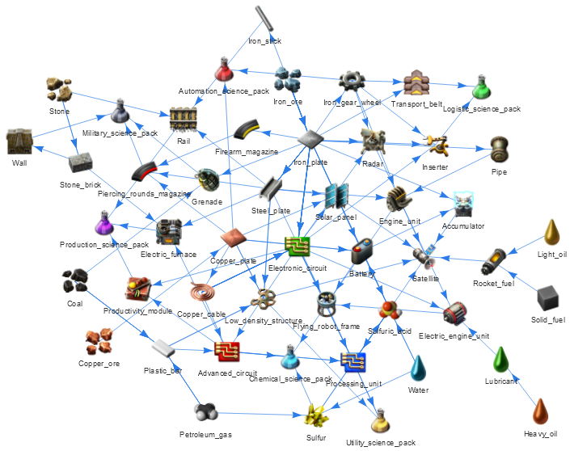
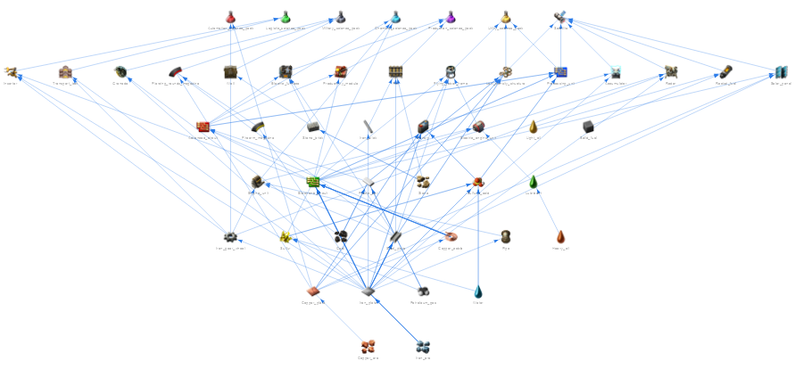
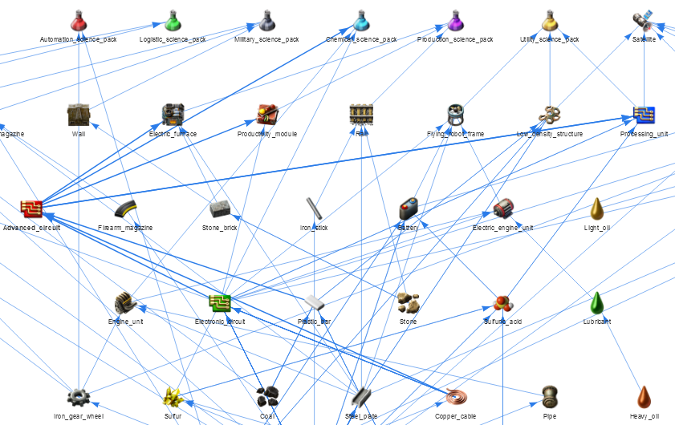

# Factorio_recipe_tree
The essence of the game Factorio can be seen in its name. The main focus of the game is to build a factory for the production of increasingly complex components. Remarkably, some components are involved in the creation of more complicated ones. Some production centers can run in parallel, some depend on the performance of others. For example, smelting steel from iron plates works independently of the production of copper cables: the consumption of one of these resources will not affect the other. An inverse figure could be, for example, copper cables and iron plates involved in the production of electronic circuit. If consumption of the latter begins to increase, then attempts to satisfy it will also lead to increased consumption of cables and plates. If these resources are involved in other productions lines, the lack of supply will lead to underproduction, which could significantly reduce factory efficiency. I see two kinds of problems here. The first is scaling: it is not enough to create a unit capable of supplying demand at this stage, the construction must involve the ability to increase production in the future. The second is supply to consumers. Briefly, the question can be described as, "Which nodes use iron for production and how do I connect the iron production section to all of the consuming units on the list?" Individually, these are simple questions. Difficulties begin emerging when there is a need to produce not 2-5 different components, but 25+ - assuming that these are interdependent components. At this stage, the complexity of the second problem is demonstrated in all its grandeur. It can be simplified by producing the necessary high-level parts in different places, but then you have to think about the amount of resources needed for each place. Maybe later I will come to this, but for now I have chosen a different approach.
This tool is the result of my unsuccessful attempts to imagine supply lines in my mind: what I got tired of drawing on paper was eventually automatically drawn on the screen.

To make it work, you have to provide a list of components that you wish to product. These are now all the research packs and the satellite instead of the last one. The system takes as input a link to a [wiki page with their description](https://wiki.factorio.com/Science_pack), and then starts examining the components needed for production. The exploration continues until all the necessary resources - down to the basics - are accounted for. After the study is done, the data is visualized in an eye-friendly way. I have attached the images below, so you can see the idea without opening the html file. If you are looking for interactivity, I invite you to explore ```recipe_tree.html```: it is possible to move each recipe, to highlight its affiliations more intensely, as well as to change the scale of view.

Written tool can be used to get recipe trees of other components including - both from the original game and from mods - as long as their description matches the [Factorio wiki](https://wiki.factorio.com) with which this crawler works.

Good progress on your design, engineer!

# Demonstration
## Slightly tuned default


## Improved data representation
|  |  |
|:--:|:--:|

# Requirements
```pip3 install bs4 pyvis```
